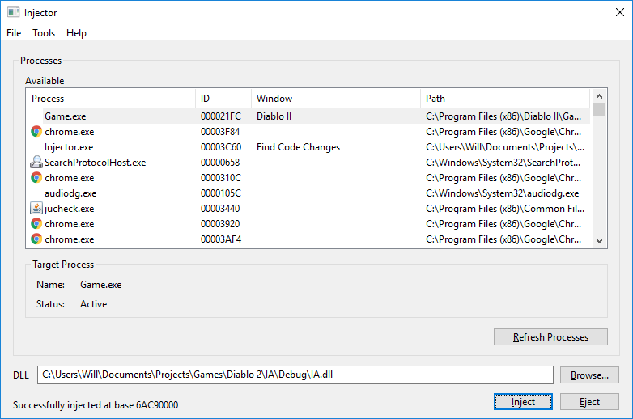
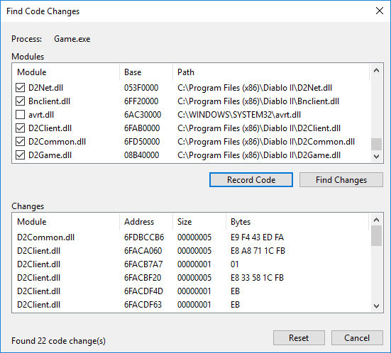
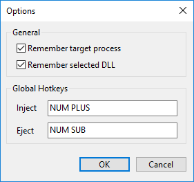

# Injector
A DLL injector compatible with 64-bit Windows 7/8/10 with features to aid development of DLL-based game mods.

## Background
Injector was written in 2011 after I couldn't find a good DLL injector with the features I wanted that was compatible with a 64-bit install of Windows 7. Injector works well as a general-purpose DLL injector but also contains additional features that are particularly useful when injecting DLLs into games. Injector is written in C using the Win32 API for the UI.

## Features
### Find Code Changes
Injector lets you record a snapshot of one or more modules of the target process and display any code changes made. If you are injecting a DLL that patches the target process code this lets you record the code, inject the DLL and then display the changes the DLL made.

### Automatically Finds Last Selected Process
Injector will remember the last selected process and will automatically find a new process with the same process name if the old one has exited. When developing a DLL you may be restarting the target process multiple times and would otherwise have to find and reselect the process every time. This feature lets you select the target process once and Injector will find the latest instance of it for you by name next time you inject or refresh.

### Customizable Global Hotkeys
Injector has customizable global hotkeys for injecting and ejecting a DLL. This means you can inject/eject a DLL while a full-screen game is open.

### Eject DLL
Injector can eject a DLL it has injected into the target process. This means you can easily inject and test your DLL, eject it, make changes and inject again without having to restart the target process. The DLL is ejected from the process based on the name of the selected DLL, for example with "C:\MyDll.dll" selected it will find and eject the module "MyDll" from the process.

### Remember Settings
Injector will remember the last selected DLL and target process throughout restarts. As generally you won't be switching which DLL and process you want to target very often, this means you don't have to reselect everything each time you start up Injector.

## Usage
Run Injector.exe, select a process and DLL and click inject. Note that if the target process is running as administrator you must also run Injector as administrator.

## Known Issues
* Injector runs on a single thread which means the UI will hang if a DLL takes a long time to inject (e.g. if it is doing a lot of work in its DllMain).
* The code needs some clean-up, particularly it needs to be separated into smaller modules without globals and magic numbers when specifying buffer sizes should be avoided.
